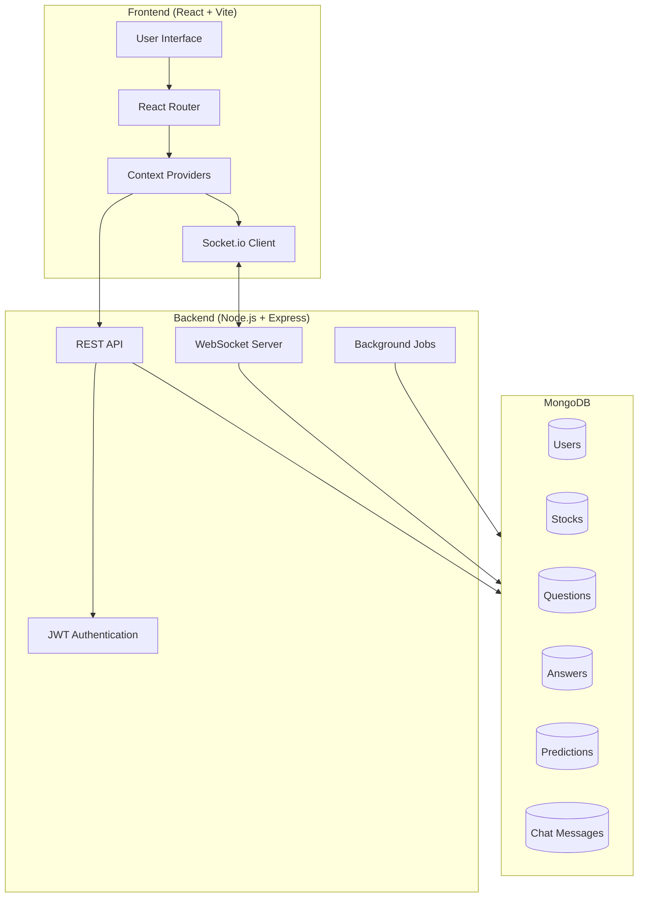
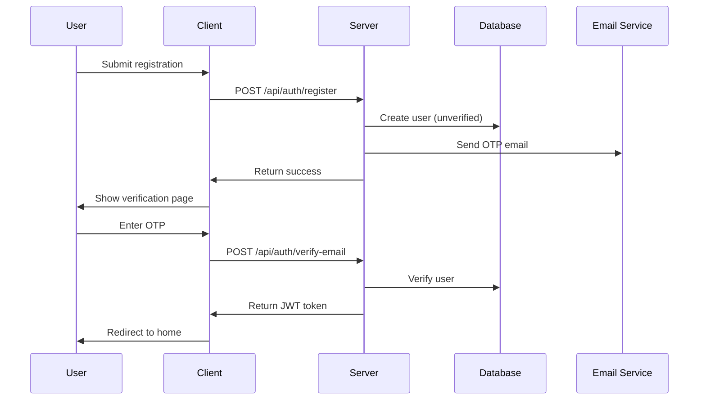
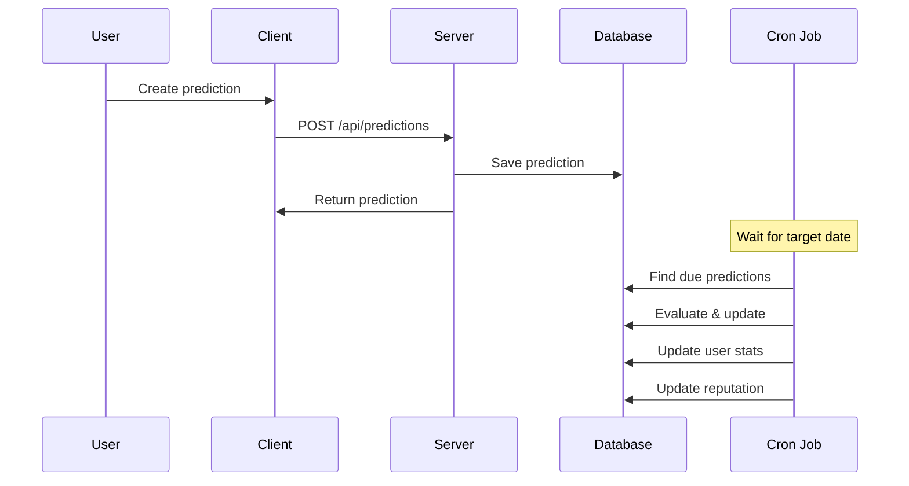

# Architecture Overview

## System Architecture

StockForumX is a full-stack MERN application with real-time capabilities, designed for stock discussions, predictions, and Q&A.



## Technology Stack

### Frontend
- **React 18** - UI library
- **Vite** - Build tool and dev server
- **React Router** - Client-side routing
- **Axios** - HTTP client
- **Socket.io Client** - Real-time communication
- **Recharts** - Data visualization
- **React Hot Toast** - Notifications
- **date-fns** - Date formatting

### Backend
- **Node.js** - Runtime environment
- **Express** - Web framework
- **MongoDB** - Database
- **Mongoose** - ODM
- **Socket.io** - WebSocket server
- **JWT** - Authentication
- **bcryptjs** - Password hashing
- **node-cron** - Scheduled jobs
- **natural** - NLP for similarity detection
- **express-validator** - Input validation
- **express-rate-limit** - Rate limiting
- **nodemailer** - Email service

## Project Structure

```
StockForumX/
├── client/                 # Frontend application
│   ├── src/
│   │   ├── components/    # Reusable components
│   │   │   ├── common/    # Shared components (Navbar, Loader, etc.)
│   │   │   ├── predictions/
│   │   │   ├── questions/
│   │   │   ├── profile/
│   │   │   └── search/
│   │   ├── pages/         # Route pages
│   │   ├── context/       # React Context providers
│   │   ├── services/      # API service layer
│   │   ├── App.jsx        # Root component
│   │   └── main.jsx       # Entry point
│   └── package.json
│
├── server/                # Backend application
│   ├── config/           # Configuration files
│   ├── models/           # Mongoose schemas
│   ├── routes/           # Express routes
│   ├── sockets/          # Socket.io handlers
│   ├── jobs/             # Cron jobs
│   ├── middleware/       # Custom middleware
│   ├── utils/            # Utility functions
│   ├── index.js          # Server entry point
│   └── package.json
│
├── shared/               # Shared constants
└── package.json          # Root workspace config
```

## Core Components

### 1. Authentication System
- JWT-based authentication
- Email verification with OTP
- Password reset functionality
- Login with OTP option
- Protected routes

### 2. Real-time Features
- Live chat per stock
- Real-time question/answer updates
- Live prediction updates
- Stock price updates

### 3. Reputation System
Formula: `reputation = accuracy × log(totalPredictions + 1) × 100`

Tiers:
- **Novice**: 0-9
- **Apprentice**: 10-49
- **Expert**: 50-99
- **Master**: 100-499
- **Legend**: 500+

### 4. Prediction System
- **Price Predictions**: Target price with 5% margin
- **Direction Predictions**: Up/Down movement
- **Timeframes**: 1h, 1d, 1w, 1m
- **Auto-evaluation**: Cron job evaluates predictions
- **Accuracy Tracking**: Updates user stats and reputation

### 5. Q&A System
- Time-expiring answers (30 days TTL)
- Upvoting/downvoting
- Accepted answers
- Similar question detection (TF-IDF)
- Tag-based organization

### 6. Background Jobs

#### Prediction Evaluator
- **Schedule**: Every 15 minutes
- **Function**: Evaluates predictions past target date
- **Updates**: User stats and reputation

#### Reputation Updater
- **Schedule**: Hourly
- **Function**: Recalculates user reputation
- **Creates**: Reputation snapshots

#### Stock Price Updater
- **Schedule**: Every 5 minutes
- **Function**: Updates mock stock prices
- **Broadcasts**: Price changes via WebSocket

## Data Flow

### User Registration Flow


### Prediction Flow


## Security Features

1. **Rate Limiting**: 100 requests per 15 minutes per IP
2. **JWT Authentication**: Secure token-based auth
3. **Password Hashing**: bcrypt with salt
4. **Input Validation**: express-validator
5. **CORS Protection**: Configured origins
6. **OTP Expiration**: Time-limited verification codes

## Scalability Considerations

### Database Indexes
- Stock queries: `symbol`, `sector`
- User queries: `username`, `email`, `reputation`
- Prediction queries: `stockId + createdAt`, `userId`, `targetDate + isEvaluated`
- Question queries: `stockId + createdAt`, `userId`, `tags`
- Answer queries: `questionId + createdAt`, `expiresAt` (TTL)

### Caching Opportunities
- Stock data (5-minute cache)
- Leaderboard (hourly cache)
- Trending questions (15-minute cache)

### WebSocket Rooms
- Stock-specific rooms: `stock:{stockId}`
- Reduces broadcast overhead
- Targeted real-time updates

## Future Enhancements

1. **Real Stock Data Integration** - Replace mock data with live APIs
2. **Advanced Analytics** - More charts and insights
3. **Social Features** - Follow users, notifications
4. **Mobile App** - React Native version
5. **AI Insights** - ML-based prediction analysis
6. **Portfolio Tracking** - Virtual portfolio management
7. **News Integration** - Stock news aggregation
8. **Advanced Search** - Elasticsearch integration
