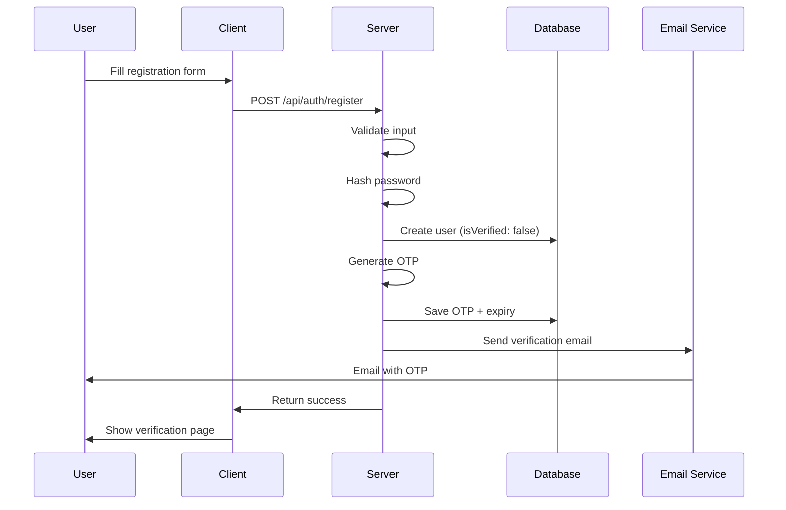

# Authentication System

StockForumX implements a comprehensive authentication system with multiple verification methods.

## Features

- JWT-based authentication
- Email verification with OTP
- Login with OTP (passwordless)
- Password reset via email
- Secure password hashing (bcrypt)
- Token-based session management

## Authentication Flow

### 1. User Registration



**Endpoint:** `POST /api/auth/register`

**Request:**
```json
{
  "username": "johndoe",
  "fullName": "John Doe",
  "email": "john@example.com",
  "password": "SecurePass123!"
}
```

**Response:**
```json
{
  "message": "Registration successful. Please verify your email.",
  "user": {
    "id": "...",
    "username": "johndoe",
    "email": "john@example.com",
    "isVerified": false
  }
}
```

---

### 2. Email Verification

**Endpoint:** `POST /api/auth/verify-email`

**Request:**
```json
{
  "email": "john@example.com",
  "otp": "123456"
}
```

**Response:**
```json
{
  "message": "Email verified successfully",
  "token": "eyJhbGciOiJIUzI1NiIsInR5cCI6IkpXVCJ9...",
  "user": { ... }
}
```

**OTP Details:**
- **Length:** 6 digits
- **Expiry:** 10 minutes
- **Storage:** Hashed in database

---

### 3. Standard Login

**Endpoint:** `POST /api/auth/login`

**Request:**
```json
{
  "email": "john@example.com",
  "password": "SecurePass123!"
}
```

**Response:**
```json
{
  "token": "eyJhbGciOiJIUzI1NiIsInR5cCI6IkpXVCJ9...",
  "user": {
    "id": "...",
    "username": "johndoe",
    "email": "john@example.com",
    "reputation": 150.5
  }
}
```

**Validation:**
- Email must be verified
- Password must match hash
- Account must not be locked

---

### 4. Login with OTP (Passwordless)

#### Step 1: Request OTP

**Endpoint:** `POST /api/auth/login-otp-init`

**Request:**
```json
{
  "email": "john@example.com"
}
```

**Response:**
```json
{
  "message": "OTP sent to your email"
}
```

#### Step 2: Verify OTP

**Endpoint:** `POST /api/auth/login-otp-verify`

**Request:**
```json
{
  "email": "john@example.com",
  "otp": "123456"
}
```

**Response:**
```json
{
  "token": "eyJhbGciOiJIUzI1NiIsInR5cCI6IkpXVCJ9...",
  "user": { ... }
}
```

---

### 5. Password Reset

#### Step 1: Request Reset

**Endpoint:** `POST /api/auth/forgot-password`

**Request:**
```json
{
  "email": "john@example.com"
}
```

**Response:**
```json
{
  "message": "Password reset OTP sent to your email"
}
```

#### Step 2: Reset Password

**Endpoint:** `POST /api/auth/reset-password`

**Request:**
```json
{
  "email": "john@example.com",
  "otp": "123456",
  "newPassword": "NewSecurePass123!"
}
```

**Response:**
```json
{
  "message": "Password reset successful"
}
```

---

## JWT Token Structure

### Token Payload

```json
{
  "id": "user_id_here",
  "iat": 1234567890,
  "exp": 1234654290
}
```

### Token Expiry

- **Default:** 30 days
- **Configurable:** Via `JWT_EXPIRES_IN` env variable

### Token Usage

**Client-Side Storage:**
```javascript
// Store token
localStorage.setItem('token', token);

// Add to requests
axios.defaults.headers.common['Authorization'] = `Bearer ${token}`;
```

**Server-Side Verification:**
```javascript
import jwt from 'jsonwebtoken';

const token = req.headers.authorization?.split(' ')[1];
const decoded = jwt.verify(token, process.env.JWT_SECRET);
const user = await User.findById(decoded.id);
```

---

## Middleware

### Auth Middleware

**File:** `server/middleware/auth.js`

```javascript
import jwt from 'jsonwebtoken';
import User from '../models/User.js';

export const auth = async (req, res, next) => {
    try {
        const token = req.headers.authorization?.split(' ')[1];
        
        if (!token) {
            return res.status(401).json({ error: 'No token provided' });
        }

        const decoded = jwt.verify(token, process.env.JWT_SECRET);
        const user = await User.findById(decoded.id).select('-password');

        if (!user) {
            return res.status(401).json({ error: 'User not found' });
        }

        req.user = user;
        next();
    } catch (error) {
        res.status(401).json({ error: 'Invalid token' });
    }
};
```

**Usage:**
```javascript
import { auth } from '../middleware/auth.js';

router.post('/predictions', auth, createPrediction);
router.get('/profile', auth, getProfile);
```

---

## Password Security

### Hashing

**Algorithm:** bcrypt with salt rounds = 10

**Implementation:**
```javascript
import bcrypt from 'bcryptjs';

// Pre-save hook in User model
userSchema.pre('save', async function (next) {
    if (!this.isModified('password')) {
        return next();
    }
    
    const salt = await bcrypt.genSalt(10);
    this.password = await bcrypt.hash(this.password, salt);
    next();
});
```

### Validation

**Requirements:**
- Minimum 6 characters
- No maximum (hashed anyway)

**Recommended:**
- At least 8 characters
- Mix of uppercase, lowercase, numbers, symbols

---

## Email Service

### Configuration

**Environment Variables:**
```env
EMAIL_HOST=smtp.gmail.com
EMAIL_PORT=587
EMAIL_USER=your-email@gmail.com
EMAIL_PASSWORD=your-app-password
EMAIL_FROM=StockForumX <noreply@stockforumx.com>
```

### Email Templates

**Verification Email:**
```
Subject: Verify Your Email - StockForumX

Hi {username},

Your verification code is: {otp}

This code expires in 10 minutes.

Best regards,
StockForumX Team
```

**Password Reset Email:**
```
Subject: Reset Your Password - StockForumX

Hi {username},

Your password reset code is: {otp}

This code expires in 10 minutes.

If you didn't request this, please ignore this email.

Best regards,
StockForumX Team
```

### Implementation

**File:** `server/utils/email.js`

```javascript
import nodemailer from 'nodemailer';

const transporter = nodemailer.createTransporter({
    host: process.env.EMAIL_HOST,
    port: process.env.EMAIL_PORT,
    auth: {
        user: process.env.EMAIL_USER,
        pass: process.env.EMAIL_PASSWORD
    }
});

export const sendOTPEmail = async (email, otp, type) => {
    const subject = type === 'verify' 
        ? 'Verify Your Email' 
        : 'Reset Your Password';
    
    const html = `
        <h2>${subject}</h2>
        <p>Your verification code is: <strong>${otp}</strong></p>
        <p>This code expires in 10 minutes.</p>
    `;

    await transporter.sendMail({
        from: process.env.EMAIL_FROM,
        to: email,
        subject,
        html
    });
};
```

---

## Client-Side Implementation

### Auth Context

**File:** `client/src/context/AuthContext.jsx`

```javascript
import { createContext, useState, useEffect } from 'react';
import axios from 'axios';

export const AuthContext = createContext();

export const AuthProvider = ({ children }) => {
    const [user, setUser] = useState(null);
    const [loading, setLoading] = useState(true);

    useEffect(() => {
        const token = localStorage.getItem('token');
        if (token) {
            axios.defaults.headers.common['Authorization'] = `Bearer ${token}`;
            fetchUser();
        } else {
            setLoading(false);
        }
    }, []);

    const fetchUser = async () => {
        try {
            const { data } = await axios.get('/api/auth/me');
            setUser(data.user);
        } catch (error) {
            localStorage.removeItem('token');
        } finally {
            setLoading(false);
        }
    };

    const login = async (email, password) => {
        const { data } = await axios.post('/api/auth/login', { email, password });
        localStorage.setItem('token', data.token);
        axios.defaults.headers.common['Authorization'] = `Bearer ${data.token}`;
        setUser(data.user);
    };

    const logout = () => {
        localStorage.removeItem('token');
        delete axios.defaults.headers.common['Authorization'];
        setUser(null);
    };

    return (
        <AuthContext.Provider value={{ user, loading, login, logout }}>
            {children}
        </AuthContext.Provider>
    );
};
```

### Protected Routes

```javascript
import { Navigate } from 'react-router-dom';
import { useAuth } from '../context/AuthContext';

function ProtectedRoute({ children }) {
    const { user, loading } = useAuth();

    if (loading) return <Loader />;
    if (!user) return <Navigate to="/login" />;

    return children;
}
```

---

## Security Best Practices

### 1. Environment Variables
- Never commit `.env` to version control
- Use strong, random JWT_SECRET
- Rotate secrets periodically

### 2. Password Storage
- Never store plain-text passwords
- Use bcrypt with sufficient salt rounds
- Consider password strength requirements

### 3. Token Management
- Set reasonable expiry times
- Implement token refresh mechanism
- Clear tokens on logout

### 4. Rate Limiting
- Limit login attempts
- Limit OTP requests
- Use express-rate-limit

### 5. Input Validation
- Validate all inputs
- Sanitize user data
- Use express-validator

### 6. HTTPS
- Always use HTTPS in production
- Secure cookies with `secure` flag
- Enable HSTS headers
