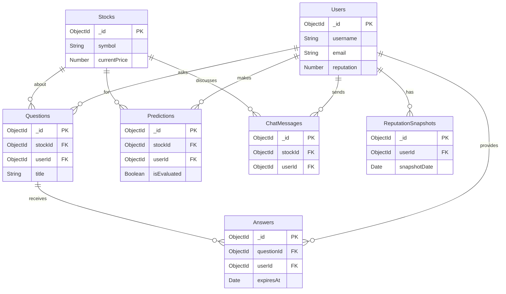

# Database Schema

## Overview

StockForumX uses MongoDB with Mongoose ODM. The database consists of 7 main collections with relationships and indexes for optimal performance.

## Collections

### 1. Users

Stores user accounts, authentication, and reputation data.

**Schema:**
```javascript
{
  username: String (unique, 3-30 chars),
  fullName: String (required),
  email: String (unique, lowercase),
  phone: String,
  location: String,
  tradingExperience: Enum ['beginner', 'intermediate', 'advanced', 'expert'],
  password: String (hashed),
  reputation: Number (default: 0),
  totalPredictions: Number (default: 0),
  accuratePredictions: Number (default: 0),
  avatar: String,
  bio: String (max 500 chars),
  status: String (max 100 chars),
  otp: String (select: false),
  otpExpires: Date (select: false),
  isVerified: Boolean (default: false),
  createdAt: Date,
  updatedAt: Date
}
```

**Virtuals:**
- `accuracy`: Calculated as `(accuratePredictions / totalPredictions) * 100`

**Indexes:**
- `username` (unique)
- `email` (unique)

**Methods:**
- `matchPassword(enteredPassword)`: Compare password with hash

---

### 2. Stocks

Stores stock information (currently mock data).

**Schema:**
```javascript
{
  symbol: String (unique, uppercase),
  name: String (required),
  sector: String (required),
  currentPrice: Number (required),
  previousClose: Number (required),
  change: Number (auto-calculated),
  changePercent: Number (auto-calculated),
  volume: Number,
  marketCap: Number,
  high24h: Number,
  low24h: Number,
  description: String,
  createdAt: Date,
  updatedAt: Date
}
```

**Indexes:**
- `symbol` (unique)

**Pre-save Hook:**
- Calculates `change` and `changePercent` when price updates

---

### 3. Questions

Stores Q&A questions about stocks.

**Schema:**
```javascript
{
  stockId: ObjectId (ref: 'Stock'),
  userId: ObjectId (ref: 'User'),
  title: String (max 200 chars),
  content: String (max 5000 chars),
  tags: [String],
  upvotes: Number (default: 0),
  upvotedBy: [ObjectId] (ref: 'User'),
  views: Number (default: 0),
  answerCount: Number (default: 0),
  hasAcceptedAnswer: Boolean (default: false),
  createdAt: Date,
  updatedAt: Date
}
```

**Indexes:**
- `stockId + createdAt` (compound)
- `userId`
- `tags`

---

### 4. Answers

Stores answers to questions with TTL (Time To Live).

**Schema:**
```javascript
{
  questionId: ObjectId (ref: 'Question'),
  userId: ObjectId (ref: 'User'),
  content: String (max 5000 chars),
  upvotes: Number (default: 0),
  upvotedBy: [ObjectId] (ref: 'User'),
  isAccepted: Boolean (default: false),
  expiresAt: Date (default: 30 days from creation),
  createdAt: Date,
  updatedAt: Date
}
```

**Indexes:**
- `questionId + createdAt` (compound)
- `userId`
- `expiresAt` (TTL index - auto-deletes after expiration)

**TTL Feature:**
MongoDB automatically deletes answers when `expiresAt` is reached, implementing time-expiring knowledge.

---

### 5. Predictions

Stores price/direction predictions with evaluation results.

**Schema:**
```javascript
{
  stockId: ObjectId (ref: 'Stock'),
  userId: ObjectId (ref: 'User'),
  predictionType: Enum ['price', 'direction'],
  targetPrice: Number (required if type='price'),
  direction: Enum ['up', 'down'] (required if type='direction'),
  timeframe: Enum ['1h', '1d', '1w', '1m'],
  targetDate: Date (auto-calculated),
  initialPrice: Number (stock price at creation),
  actualPrice: Number (stock price at evaluation),
  isEvaluated: Boolean (default: false),
  isCorrect: Boolean,
  reasoning: String (max 1000 chars),
  createdAt: Date,
  updatedAt: Date
}
```

**Indexes:**
- `stockId + createdAt` (compound)
- `userId`
- `targetDate + isEvaluated` (compound, for cron job)

**Evaluation Logic:**
- **Price**: Correct if within 5% margin of target
- **Direction**: Correct if price moved in predicted direction

---

### 6. ChatMessages

Stores real-time chat messages per stock.

**Schema:**
```javascript
{
  stockId: ObjectId (ref: 'Stock'),
  userId: ObjectId (ref: 'User'),
  message: String (max 500 chars),
  createdAt: Date,
  updatedAt: Date
}
```

**Indexes:**
- `stockId + createdAt` (compound)

---

### 7. ReputationSnapshots

Stores historical reputation data for tracking.

**Schema:**
```javascript
{
  userId: ObjectId (ref: 'User'),
  reputation: Number,
  totalPredictions: Number,
  accuratePredictions: Number,
  accuracy: Number,
  snapshotDate: Date,
  createdAt: Date
}
```

**Indexes:**
- `userId + snapshotDate` (compound)

---

## Relationships



## Data Integrity

### Cascading Deletes

Currently not implemented. Consider adding:
- Delete user's questions/answers/predictions when user is deleted
- Delete question's answers when question is deleted

### Validation

All models use Mongoose validators:
- Required fields
- String length limits
- Enum values
- Email format
- Unique constraints

## Performance Optimization

### Indexes Strategy

1. **Compound Indexes**: For common query patterns
   - `stockId + createdAt`: Fetch recent items per stock
   - `targetDate + isEvaluated`: Cron job efficiency

2. **Single Indexes**: For lookups and filters
   - `userId`: User-specific queries
   - `tags`: Tag-based filtering

3. **TTL Index**: Automatic document expiration
   - `expiresAt`: Auto-delete expired answers

### Query Optimization Tips

1. **Use `.select()`** to fetch only needed fields
2. **Use `.lean()`** for read-only queries (faster)
3. **Populate sparingly** - only when needed
4. **Limit results** with `.limit()` and pagination
5. **Use aggregation** for complex analytics

## Sample Queries

### Get Top Users by Reputation
```javascript
User.find()
  .sort({ reputation: -1 })
  .limit(10)
  .select('username reputation totalPredictions accuracy');
```

### Get Unevaluated Predictions Due for Evaluation
```javascript
Prediction.find({
  isEvaluated: false,
  targetDate: { $lte: new Date() }
})
.populate('stockId userId');
```

### Get Recent Questions for a Stock
```javascript
Question.find({ stockId })
  .sort({ createdAt: -1 })
  .limit(20)
  .populate('userId', 'username reputation');
```

### Get User's Prediction Accuracy by Timeframe
```javascript
Prediction.aggregate([
  { $match: { userId, isEvaluated: true } },
  { $group: {
      _id: '$timeframe',
      total: { $sum: 1 },
      accurate: { $sum: { $cond: ['$isCorrect', 1, 0] } }
    }
  },
  { $project: {
      timeframe: '$_id',
      total: 1,
      accurate: 1,
      accuracy: { $multiply: [{ $divide: ['$accurate', '$total'] }, 100] }
    }
  }
]);
```

## Migration Notes

### Adding New Fields

Use migrations for schema changes:

```javascript
// Example: Add new field to existing users
await User.updateMany(
  { tradingExperience: { $exists: false } },
  { $set: { tradingExperience: '' } }
);
```

### Seeding Data

Use the seeder script:
```bash
cd server
npm run seed
```

See `server/utils/seeders.js` for implementation.
