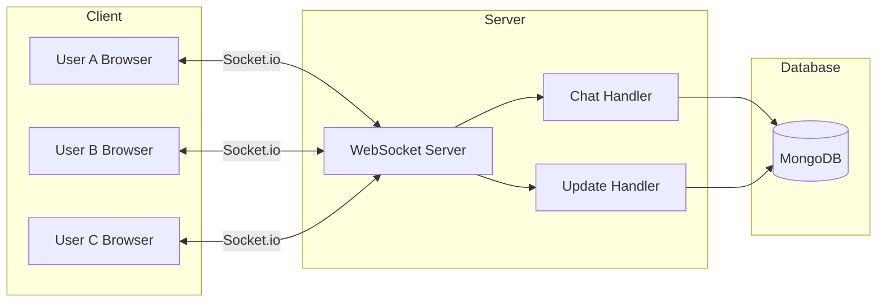

# Real-Time Features

StockForumX uses **Socket.io** for real-time, bidirectional communication between clients and the server.

## Architecture



## Connection Setup

### Server-Side (index.js)

```javascript
import { Server } from 'socket.io';
import { createServer } from 'http';

const httpServer = createServer(app);
const io = new Server(httpServer, {
    cors: {
        origin: process.env.CLIENT_URL || 'http://localhost:5173',
        methods: ['GET', 'POST']
    }
});

io.on('connection', (socket) => {
    console.log('New client connected:', socket.id);
    
    setupChatHandlers(io, socket);
    setupUpdateHandlers(io, socket);
});
```

### Client-Side (SocketContext.jsx)

```javascript
import { io } from 'socket.io-client';

const socket = io('http://localhost:5000', {
    autoConnect: false
});

// Connect when authenticated
socket.connect();
```

## Room-Based Architecture

### Stock Rooms

Each stock has its own room for isolated communication:

**Room Format:** `stock:{stockId}`

**Benefits:**
- Reduces unnecessary broadcasts
- Users only receive updates for stocks they're viewing
- Better scalability

## Events

### Chat Events

#### 1. Join Stock Room
**Client → Server**
```javascript
socket.emit('join:stock', stockId);
```

**Purpose:** Subscribe to updates for a specific stock

---

#### 2. Leave Stock Room
**Client → Server**
```javascript
socket.emit('leave:stock', stockId);
```

**Purpose:** Unsubscribe from stock updates

---

#### 3. Send Chat Message
**Client → Server**
```javascript
socket.emit('chat:message', {
    stockId: '...',
    userId: '...',
    message: 'Great analysis!'
});
```

**Server → Clients (in room)**
```javascript
socket.on('chat:message', (data) => {
    // data contains populated message with user info
    console.log(data.userId.username, ':', data.message);
});
```

**Flow:**
1. Client sends message
2. Server saves to database
3. Server populates user data
4. Server broadcasts to all clients in stock room

---

#### 4. Typing Indicator
**Client → Server**
```javascript
socket.emit('chat:typing', {
    stockId: '...',
    username: 'johndoe'
});
```

**Server → Other Clients (in room)**
```javascript
socket.on('chat:typing', (data) => {
    console.log(`${data.username} is typing...`);
});
```

---

### Update Events

#### 1. New Question
**Server → Clients**
```javascript
socket.on('question:new', (question) => {
    // New question posted for this stock
    console.log('New question:', question.title);
});
```

---

#### 2. New Answer
**Server → Clients**
```javascript
socket.on('answer:new', (answer) => {
    // New answer posted
    console.log('New answer to question:', answer.questionId);
});
```

---

#### 3. New Prediction
**Server → Clients**
```javascript
socket.on('prediction:new', (prediction) => {
    // New prediction made
    console.log('New prediction:', prediction);
});
```

---

#### 4. Stock Price Update
**Server → Clients**
```javascript
socket.on('stock:update', (stock) => {
    // Stock price changed
    console.log(`${stock.symbol}: $${stock.currentPrice}`);
});
```

**Triggered by:** Background job (every 5 minutes)

---

## Implementation Examples

### Client-Side: Chat Component

```javascript
import { useSocket } from '../context/SocketContext';
import { useState, useEffect } from 'react';

function Chat({ stockId }) {
    const socket = useSocket();
    const [messages, setMessages] = useState([]);
    const [input, setInput] = useState('');

    useEffect(() => {
        // Join room
        socket.emit('join:stock', stockId);

        // Listen for messages
        socket.on('chat:message', (message) => {
            setMessages(prev => [...prev, message]);
        });

        // Cleanup
        return () => {
            socket.emit('leave:stock', stockId);
            socket.off('chat:message');
        };
    }, [stockId]);

    const sendMessage = () => {
        socket.emit('chat:message', {
            stockId,
            userId: currentUser.id,
            message: input
        });
        setInput('');
    };

    return (
        <div>
            {messages.map(msg => (
                <div key={msg._id}>
                    <strong>{msg.userId.username}:</strong> {msg.message}
                </div>
            ))}
            <input 
                value={input} 
                onChange={(e) => setInput(e.target.value)}
                onKeyPress={(e) => e.key === 'Enter' && sendMessage()}
            />
        </div>
    );
}
```

### Server-Side: Broadcasting Updates

```javascript
// In routes/questions.js
router.post('/', auth, async (req, res) => {
    const question = await Question.create(req.body);
    
    // Broadcast to all clients in stock room
    const io = req.app.get('io');
    io.to(`stock:${question.stockId}`).emit('question:new', question);
    
    res.status(201).json({ question });
});
```

### Server-Side: Background Job Broadcasting

```javascript
// In jobs/stockPriceUpdater.js
import { io } from '../index.js';

cron.schedule('*/5 * * * *', async () => {
    const stocks = await Stock.find();
    
    for (const stock of stocks) {
        // Update price
        stock.currentPrice = calculateNewPrice(stock);
        await stock.save();
        
        // Broadcast to all clients watching this stock
        io.to(`stock:${stock._id}`).emit('stock:update', stock);
    }
});
```

## Error Handling

### Client-Side

```javascript
socket.on('error', (error) => {
    console.error('Socket error:', error.message);
    toast.error(error.message);
});

socket.on('connect_error', (error) => {
    console.error('Connection error:', error);
});
```

### Server-Side

```javascript
socket.on('chat:message', async (data) => {
    try {
        // Process message
    } catch (error) {
        console.error('Chat message error:', error);
        socket.emit('error', { message: 'Failed to send message' });
    }
});
```

## Performance Considerations

### 1. Room-Based Broadcasting
**Good:** Broadcast only to relevant clients
```javascript
io.to(`stock:${stockId}`).emit('update', data);
```

**Bad:** Broadcast to all clients
```javascript
io.emit('update', data); // Sends to everyone!
```

### 2. Throttling/Debouncing

For typing indicators:
```javascript
const debouncedTyping = debounce(() => {
    socket.emit('chat:typing', { stockId, username });
}, 300);
```

### 3. Connection Pooling

Limit concurrent connections per user:
```javascript
const userConnections = new Map();

io.on('connection', (socket) => {
    const userId = socket.handshake.auth.userId;
    
    if (userConnections.get(userId) >= 3) {
        socket.disconnect();
        return;
    }
});
```

## Testing Real-Time Features

### Manual Testing

1. Open multiple browser windows
2. Navigate to same stock page
3. Send chat messages
4. Verify all windows receive updates

### Automated Testing

```javascript
import { io } from 'socket.io-client';

describe('Chat Socket', () => {
    let socket;

    beforeEach((done) => {
        socket = io('http://localhost:5000');
        socket.on('connect', done);
    });

    afterEach(() => {
        socket.close();
    });

    it('should receive chat messages', (done) => {
        socket.emit('join:stock', 'test-stock-id');
        
        socket.on('chat:message', (message) => {
            expect(message.message).toBe('Test message');
            done();
        });

        socket.emit('chat:message', {
            stockId: 'test-stock-id',
            userId: 'test-user-id',
            message: 'Test message'
        });
    });
});
```

## Security Considerations

### 1. Authentication

Verify user identity before processing events:
```javascript
socket.on('chat:message', async (data) => {
    const user = await verifySocketAuth(socket);
    if (!user) {
        socket.emit('error', { message: 'Unauthorized' });
        return;
    }
    // Process message
});
```

### 2. Rate Limiting

Prevent spam:
```javascript
const messageRateLimiter = new Map();

socket.on('chat:message', (data) => {
    const userId = data.userId;
    const now = Date.now();
    const userMessages = messageRateLimiter.get(userId) || [];
    
    // Allow max 5 messages per 10 seconds
    const recentMessages = userMessages.filter(t => now - t < 10000);
    if (recentMessages.length >= 5) {
        socket.emit('error', { message: 'Too many messages' });
        return;
    }
    
    messageRateLimiter.set(userId, [...recentMessages, now]);
    // Process message
});
```

### 3. Input Validation

Sanitize all inputs:
```javascript
import validator from 'validator';

socket.on('chat:message', (data) => {
    const message = validator.escape(data.message);
    // Process sanitized message
});
```

## Debugging

### Enable Debug Logs

**Client:**
```javascript
localStorage.debug = 'socket.io-client:socket';
```

**Server:**
```bash
DEBUG=socket.io:* node index.js
```

### Monitor Connections

```javascript
io.on('connection', (socket) => {
    console.log('Connected:', socket.id);
    console.log('Total connections:', io.engine.clientsCount);
    
    socket.on('disconnect', () => {
        console.log('Disconnected:', socket.id);
    });
});
```
